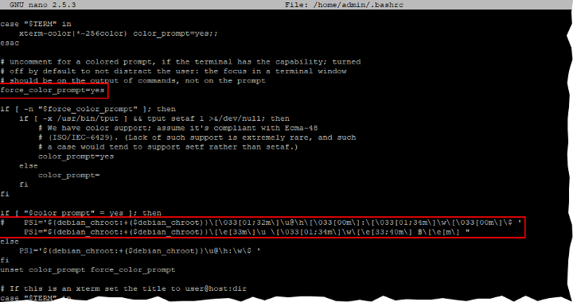
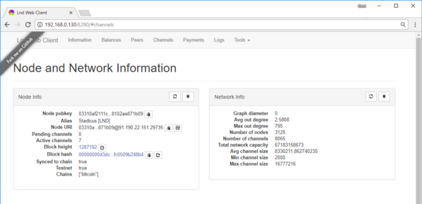

# Universal Bitcoin & Lightning Full node

based on Ubuntu 16.04 LTS, Bitcoin Core and LND


### Purpose

The aim is to set up a Bitcoin Core and Lightning node that 

* is as fully validating Bitcoin Full Node and does not require any trust in a 3rd party,
* is reliably running 24/7, 
* is part of and supports the decentralization of the Lightning network by routing payments and 
* can be used to send and receive personal payments using the command line interface.

This server is set up without graphical user interface and is used remotely using the Secure Shell (SSH) command line. In the future, this server should be able to function as a personal backend for desktop and mobile wallets, but I haven’t found a good solution to this yet. So, command line it is for the moment.

**Spoiler alert**: this is the goal of this guide, simply buying a Blockaccino.

[](https://vimeo.com/258395303)

Things on my todo list:

- [ ] email alerts
- [ ] web interface
- [ ] backend for desktop und mobile wallet

### Target audience

This is not a beginner’s guide, but the setup is comparable to the [RaspiBolt guide](../raspibolt/README.md) that explains the same setup on a Raspberry Pi, so you can easily get more detailed explanations from there. The goal is to do everything ourselves, no shortcuts that involve trust in a 3rd party allowed. This makes this guide quite technical, but I try to make it as straightforward as possible.

If you like to learn more about Linux, Bitcoin and Lightning, this guide is for you.

### Requirements

It does not really matter if you want to set up your node on an old desktop or laptop computer, a local virtual machine or a virual server in the cloud.

It's important to use the following software components:

* **Ubuntu 16.04.4 LTS (Xenial Xerus)**
  This guide uses the 64-bit Server image, but it will also run with the Desktop image.
* **Bitcoin Core 0.16.0**
  The Bitcoin Core reference installation is used for maximal interoperability.
* **Lightning Network Daemon (LND)**
  LND is the first Lighting client ready for mainnet and is very well suited as a backend. Other implementations like Acinq Eclair and Blockstream c-lightning will also work in this setup.

# Setting up the Ubuntu Server

### Write down your passwords

You will need several passwords and I find it easiest to write them all down in the beginning, instead of bumping into them throughout the guide. They should be unique and very secure, at least 12 characters in length. Do not use uncommon special characters, blanks or quotes (‘ or “).

```
[ A ] Master user password
[ B ] Bitcoin RPC password
[ C ] LND wallet password
[ D ] LND seed password (optional)
```

We use Ubuntu 16.04.4 LTS. 

https://www.ubuntu.com/download/server

Download the image, flash it on your USB Stick or other preferred method and start your node with it. 

\~~~ Work In Progress ~~~

### 4) Connecting to the network

Give your Thundroid a fixed IP address in the DCHP settings of your router. See section (4) of the [RaspiBolt guide](../raspibolt/README.md) for additional information.

### 5) Working on your Node

#### The command prompt

Everything is configured on the Linux command prompt. Throughout this guide I use the following notation:

```
# this is a comment, just for information
```

```
$ command            This is a command to enter (without the $) 
                     and confirm with the enter key
```

```
No prefix            This is either an output of the command above
                     or something you can copy/paste into a file
```

When you enter commands, you can use the “Tab” key for autocompletion, eg. for commands, directories or filenames.

If you are using Windows, I recommend to use the SSH client [KiTTY](http://kitty.9bis.com). You can **copy** text from the shell by selecting it with your mouse (no need to click anything), and **paste** stuff with a right-click.

#### Basic configuration

Connect to the node using SSH. The access credentials are

* user: `root`
* password: `odroid`

```
# change root password to [password A]
$ passwd 
```

```
# wait until the process 'unattended-upgr' is finished (about 5 minutes), restart
$ top
$ shutdown -r now

# update the operating system
$ apt update
$ apt dist-upgrade
$ apt install linux-image-xu3 
# answer [y], then [no] (do not abort)
```

```
# install some additional software
$ apt install htop git curl bash-completion jq
```

```
# set time zone & localization
$ dpkg-reconfigure tzdata
$ dpkg-reconfigure locales
```

When using the Nano text editor, you can use the same keyboard shortcuts to save (Ctrl-O, confirm or change filename & press enter) and exit (Ctrl-X).

```
# change hostname (replace "odroid" with "thundroid" :)
$ nano /etc/hostname
$ nano /etc/hosts
```

```
# create user "admin" and change password to [password A]
$ adduser admin
$ adduser admin sudo
```

```
# create user "bitcoin" and change password to [password C]
$ adduser bitcoin
```

#### Mounting the hard disk

```
# get NAME for hard disk
$ lsblk -o UUID,NAME,FSTYPE,SIZE,LABEL,MODEL
```

```
# format hard disk (use [NAME] from above, e.g /dev/sda1)
$ mkfs.ext4 /dev/[NAME]
```

```
# get UUID for hard disk, copy into notepad
$ lsblk -o UUID,NAME,FSTYPE,SIZE,LABEL,MODEL
```

```
# edit fstab and enter new line (replace UUID) at the end 
$ nano /etc/fstab
UUID=123456 /mnt/hdd ext4 noexec,defaults 0 0
```

```
# create mount point, mount, check and set owner
$ mkdir /mnt/hdd
$ mount -a
$ df /mnt/hdd
Filesystem     1K-blocks      Used Available Use% Mounted on
/dev/sda1      961300808 600388836 312057600  66% /mnt/hdd
```

```
$ chown bitcoin:bitcoin /mnt/hdd/
```

```
# make sure user "admin" uses bash as standard shell
$ chsh admin -s /bin/bash
```

#### Creating a Swap File

The usage of a swap file can degrade your SD card very quickly. Therefore, we will move it to the external hard disk.

```
$ mkdir /mnt/hdd/swap
$ dd if=/dev/zero of=/mnt/hdd/swap/swapfile bs=1M count=4096
$ chmod -R 0600 /mnt/hdd/swap/
$ mkswap /mnt/hdd/swap/swapfile
$ swapon /mnt/hdd/swap/swapfile

$ nano /etc/fstab
/mnt/hdd/swap/swapfile    none    swap    sw    0   0

swapon -s
```

```
# restart
$ shutdown -r now
```

### 6) Hardening your Thundroid

Your Thundroid will handle money and needs to be super-secure. Login as “admin” (we will not use “root” again).

#### fail2ban

Fail2ban monitors SSH login attempts and bans a remote peer after 5 unsuccessful tries for 10 minutes.

```
$ sudo apt install fail2ban
```

#### UFW: Uncomplicated Firewall

The firewall denies all connection attempts from other peers by default and allows only specific ports to be used.

```
# change session to "root"
$ sudo su
```

The line `ufw allow from 192.168.0.0/24 …` below assumes that the IP address of your Pi is something like `192.168.0.???`, the ??? being any number from 0 to 255. If your IP address is `12.34.56.78`, you must adapt this line to `ufw allow from 12.34.56.**0**/24 …`.

```
$ apt install ufw
$ ufw default deny incoming
$ ufw default allow outgoing
$ ufw allow from 192.168.0.0/24 to any port 22 comment 'allow SSH from local LAN'
$ ufw allow 9735 comment  'allow Lightning'
$ ufw allow 8333 comment  'allow Bitcoin mainnet'
$ ufw allow 18333 comment 'allow Bitcoin testnet'
$ ufw enable
$ systemctl enable ufw
$ ufw status
```

```
# exit "root" session back to "admin"
$ exit
```

#### SSH Keys

We will disable login via password completely and require a SSH certificate. To create it for your “admin” user, please follow this guide:

[**Configure "No Password SSH Keys Authentication" with PuTTY on Linux Servers***SSH ( Secure SHELL) is one of the most used network protocol to connect and login to remote Linux servers, due to its…*www.tecmint.com](https://www.tecmint.com/ssh-passwordless-login-with-putty/)

If you can log in as “admin” with your SSH key (check!), we disable the password login.

```
$ sudo nano /etc/ssh/sshd_config
# change ChallengeResponseAuthentication and PasswordAuthentication 
# to "no" (uncomment if necessary), save and exit
 
# copy the SSH public key for user "root", just in case
$ sudo mkdir /root/.ssh
$ sudo cp /home/admin/.ssh/authorized_keys /root/.ssh/
$ sudo chown -R root:root /root/.ssh/
$ sudo chmod -R 700 /root/.ssh/
```

```
$ sudo systemctl restart sshd.service
```

You can now only login with “admin” or “root” and your SSH key. As you cannot connect a screen to the Odroid, SSH is your only option.

⚠️ **Backup your SSH key! There is no fallback login!**

Worst case scenario: you need to flash the MicroSD card and set up the system again, all important stuff is still on the harddrive.

### 6½) Prettify your Thundroid

The following is not exactly necessary, but I think still worth the effort. 🖖

#### Bash completion

As user “**admin**”, install bash completion scripts for Bitcoin Core and all Lightning projects. You then can complete commands by pressing the Tab key (e.g. `bitcoin-cli getblockch [Tab]` → `bitcoin-cli getblockchaininfo` )

```
$ cd /home/admin/download
$ wget https://raw.githubusercontent.com/bitcoin/bitcoin/master/contrib/bitcoin-cli.bash-completion 
$ wget https://raw.githubusercontent.com/ACINQ/eclair/master/contrib/eclair-cli.bash-completion
$ wget https://raw.githubusercontent.com/lightningnetwork/lnd/master/contrib/lncli.bash-completion
$ wget https://raw.githubusercontent.com/ElementsProject/lightning/master/contrib/lightning-cli.bash-completion
```

```
$ sudo cp *.bash-completion /etc/bash_completion.d/
```

#### Pimp the command line prompt

You can prettify your command prompt by enabling color output and setting a custom prompt. 

  

*I use the red prompt for user “admin”, and the yellow prompt for “bitcoin”.*

```
$ nano /home/admin/.bashrc
# uncomment 
force_color_prompt=yes
# add (see screenshot)
PS1="${debian_chroot:+($debian_chroot)}\[\e[33m\]\u \[\033[01;34m\]\w\[\e[33;40m\] ฿\[\e[m\] "
# set "ls" to always use the -la option (add at the end of the file)
alias ls='ls -la --color=always'

$ source /home/admin/.bashrc
```

  

*It’s safest to comment # the original line and add the new color prompt below*

### Increase your open files limit

In case your RaspiBolt is swamped with internet requests (honest or malicious due to a DDoS attack), you will quickly encounter the `can't accept connection: too many open files` error. This is due to a limit on open files (representing individual tcp connections) that is set too low.

Edit the following three files, add the additional line(s) right before the end comment, save and exit.

```
$ sudo nano /etc/security/limits.conf
*    soft nofile 128000
*    hard nofile 128000
root soft nofile 128000
root hard nofile 128000
```

[](https://github.com/Stadicus/guides/blob/master/raspibolt/images/20_nofile_limits.png)

```
$ sudo nano /etc/pam.d/common-session
session required pam_limits.so
```

[](https://github.com/Stadicus/guides/blob/master/raspibolt/images/20_nofile_common-session.png)

```
$ sudo nano /etc/pam.d/common-session-noninteractive
session required pam_limits.so
```

[](https://github.com/Stadicus/guides/blob/master/raspibolt/images/20_nofile_common-session-noninteractive.png)


## Bitcoin 

Installing the Bitcoin Core software connects our node to the Bitcoin network, and allows us to use it also as a trustless Full Node.

Install it the speedy way with the following run-through, or check the [RaspiBolt guide](../raspibolt/README.md) chapter (7) for more details (just use the user “admin” instead of “pi”).

```
$ mkdir /home/admin/download
$ cd /home/admin/download
```

```
# download the latest Bitcoin Core ARM binaries (check https://bitcoin.org/en/download)
$ wget https://bitcoin.org/bin/bitcoin-core-0.16.0/bitcoin-0.16.0-arm-linux-gnueabihf.tar.gz
$ wget https://bitcoin.org/bin/bitcoin-core-0.16.0/SHA256SUMS.asc
$ wget https://bitcoin.org/laanwj-releases.asc
```

```
# check that the reference checksum matches the real checksum
# output: "bitcoin-0.16.0-arm-linux-gnueabihf.tar.gz: OK"
$ sha256sum --check SHA256SUMS.asc --ignore-missing
```

```
# manually check the fingerprint of the public key:
# 01EA 5486 DE18 A882 D4C2  6845 90C8 019E 36C2 E964
$ gpg --with-fingerprint ./laanwj-releases.asc
```

```
# import the public key and verify the signed checksum file
# output: "Good signature from Wladimir ..."
# check the fingerprint again in case of malicious keys 
# 01EA 5486 DE18 A882 D4C2  6845 90C8 019E 36C2 E964
$ gpg --import ./laanwj-releases.asc
$ gpg --verify SHA256SUMS.asc
```

```
# extract, install and check active version
$ tar -xvf bitcoin-0.16.0-arm-linux-gnueabihf.tar.gz
$ sudo install -m 0755 -o root -g root -t /usr/local/bin bitcoin-0.16.0/bin/*
$ bitcoind --version
Bitcoin Core Daemon version v0.16.0
```

```
# configuration
$ sudo su bitcoin
$ mkdir /mnt/hdd/bitcoin
$ ln -s /mnt/hdd/bitcoin /home/bitcoin/.bitcoin
```

```
# copy/paste the following Bitcoin configuration file 
# (replace PASSWORD_[E] with your password)
$ nano /home/bitcoin/.bitcoin/bitcoin.conf
```


https://gist.github.com/Stadicus/5be012d19d56be0234c93a8bb28f080b#file-bitcoin-conf


```
# back to user "admin"
$ exit
```

```
# copy/paste the following systemd unit file
$ sudo nano /etc/systemd/system/bitcoind.service
```


https://gist.github.com/Stadicus/0f6df973c936d74200298dee3d50b688#file-bitcoind-service


```
# Enable the unit file and start it manually
$ sudo systemctl enable bitcoind
$ sudo systemctl start bitcoind
$ systemctl status bitcoind
```

```
# check bitcoind operations (exit with Ctrl-C)
$ sudo tail -f /home/bitcoin/.bitcoin/testnet3/debug.log
```

```
# check bitcoin blockchain verification progress
$ sudo su bitcoin
$ bitcoin-cli getblockchaininfo
```

```
# check public visibility
$ curl -sL https://bitnodes.earn.com/api/v1/nodes/me-18333/ | jq
{
  "success": true
}
```

Optional: if you installed Tor, check if it is recognized by bitcoind.

```
$ sudo cat /home/bitcoin/.bitcoin/testnet3/debug.log | grep tor:
2018-02-25 13:50:23 tor: Thread interrupt
2018-02-25 13:51:19 tor: Got service ID tysrolynofiqkigu, advertising service tysrolynofiqkigu.onion:28333
```

At this time, no wallet needs to be created, as LND does not require the Bitcoin Core wallet.


## Lightning Network

We will compile and install the **LND Lightning** node. Other Lighting nodes like Eclair or c-lightning can also be installed, even simultaneously. However, only one should run at any given time.

### Public IP script

To announce our public IP address to the Lightning network, we need to get it first from a source outside our network. As user “admin”, create the following script that checks the IP all 5 minutes and stores it locally.

```
# create script getpublicip.sh (paste the following gist)
$ sudo nano /usr/local/bin/getpublicip.sh
```


https://gist.github.com/Stadicus/76e7b86976477d8980ef37fc263254c7#file-getpublicip-sh


```
# make it executable
$ sudo chmod +x /usr/local/bin/getpublicip.sh
```

```
# paste systemd unit [getpublicip.service], save and exit
$ sudo nano /etc/systemd/system/getpublicip.service
```


https://gist.github.com/Stadicus/1e1d3800f33559940d6a388a95b5a2d8#file-getpublicip-service


```
# enable systemd startup 
$ sudo systemctl enable getpublicip
$ sudo systemctl start getpublicip
$ sudo systemctl status getpublicip
```

```
# check if data file has been created
$ cat /run/publicip
PUBLICIP=91.190.22.151
```


### Lightning: LND

As user “**admin**”, we first need to install Go compiler, clone the LND source code, compile and install it.

#### LND installation

```
$ cd /home/admin/download
$ wget https://github.com/lightningnetwork/lnd/releases/download/v0.4-beta/lnd-linux-arm-v0.4-beta.tar.gz
$ wget https://github.com/lightningnetwork/lnd/releases/download/v0.4-beta/manifest-v0.4-beta.txt
$ wget https://github.com/lightningnetwork/lnd/releases/download/v0.4-beta/manifest-v0.4-beta.txt.sig
$ wget https://keybase.io/roasbeef/pgp_keys.asc
$ sha256sum --check manifest-v0.4-beta.txt --ignore-missing
> lnd-linux-arm-v0.4-beta.tar.gz: OK$ gpg ./pgp_keys.asc
> 65317176B6857F98834EDBE8964EA263DD637C21

$ gpg --import ./pgp_keys.asc
$ gpg --verify manifest-v0.4-beta.txt.sig
> gpg: Good signature from "Olaoluwa Osuntokun <laolu32@gmail.com>" [unknown]
> Primary key fingerprint: 6531 7176 B685 7F98 834E  DBE8 964E A263 DD63 7C21

$ tar -xzf lnd-linux-arm-v0.4-beta.tar.gz
$ ls -la$ sudo install -m 0755 -o root -g root -t /usr/local/bin lnd-linux-arm-v0.4-beta/*
$ lnd --version> lnd version 0.4.0-alpha
```


#### LND configuration

```
# session with user "bitcoin"
$ sudo su bitcoin
$ mkdir /mnt/hdd/lnd_testnet
$ ln -s /mnt/hdd/lnd_testnet /home/bitcoin/.lnd
```

```
# create LND configuration and paste the following content
# (change the alias to your battle name)
$ nano /home/bitcoin/.lnd/lnd.conf
```


https://gist.github.com/Stadicus/6d53d50c707a14a5f067958b0a6faa60#file-lnd-conf


```
# exit user session back to user "admin"
$ exit
```

```
# create LND systemd unit and paste the following content
$ sudo nano /etc/systemd/system/lnd.service
```


https://gist.github.com/Stadicus/f0c6db4fa6cf787f19d9d3444b91633f#file-lnd-service


```
# enable and start LND
$ sudo systemctl enable lnd
$ sudo systemctl start lnd
$ systemctl status lnd
● lnd.service - LND Lightning Daemon
   Loaded: loaded (/etc/systemd/system/lnd.service; ........)
   Active: active (running) ......
 Main PID: 9064 (lnd)
   CGroup: /system.slice/lnd.service
           └─9064 /usr/local/bin/lnd --externalip=91.190.22.151
```

```
# follow the LND logfile (exit with Ctrl-C)
$ sudo journalctl -f -u lnd
```

**LND wallet setup**

*LND logfile: Waiting for wallet encryption password. Use `lncli create` to create wallet, or `lncli unlock` to unlock already created wallet.*

For security reasons, only user “**bitcoin**” can interact with bitcoind and lnd.

```
$ sudo su bitcoin
```

```
# first time starting LND
$ lncli create
```

```
# after that, every time starting LND
$ lncli unlock
```

```
# get some information & a bitcoin deposit address 
$ lncli newaddress np2wkh
{
    "address": "2N5TDE1KBP3k8oQ9i3yCRahUJ7y6bUHNeid"
}
```

Now, get some tBTC from a Faucet, eg. [https://testnet.coinfaucet.eu](https://testnet.coinfaucet.eu/) and send them to this new address. As we enabled the “autopilot” feature, LND will automatically open channels.

Get yourself a payment request on [StarBlocks](https://starblocks.acinq.co/#/) or [Y’alls](https://yalls.org/) and move some coins!

```
$ lncli walletbalance
$ lncli listchannels
$ lncli sendpayment --pay_req=lntb32u1pdg7p...y0gtw6qtq0gcpk50kww
```

👉 additional information: [LND API](http://api.lightning.community) reference with examples


## Additional Stuff (Backup)

### Web interface

Next up on my bucket list is a nice, clean web interface, like this one:

  


Check back for further details soon! 😏

### Various

#### Add system overview

To get a quick overview over the system status, I created [a shell script](https://gist.github.com/Stadicus/ffbbd855d23cd068f7b739cae6440f4b) that is shown on login or on demand.


*This script will run as root, so please check it before blindly trusting me.*


```
# as user "admin"
$ cd /home/admin/download/
$ wget https://gist.githubusercontent.com/Stadicus/ffbbd855d23cd068f7b739cae6440f4b/raw/ab2c97bd554c003b88f5e9a8793a047805d5e4b0/20-thundroid-welcome
```

```
# check script & exit
$ nano 20-thundroid-welcome
```

```
# delete existing welcome scripts and install
$ sudo rm /etc/update-motd.d/*
$ sudo cp 20-thundroid-welcome /etc/update-motd.d/
$ sudo chmod +x /etc/update-motd.d/20-thundroid-welcome
$ sudo ln -s /etc/update-motd.d/20-thundroid-welcome /usr/local/bin/thundroid
```


### Closing comments

Let me know what you think. And if you actually did set up a node with this guide, I’d love to hear from you!
